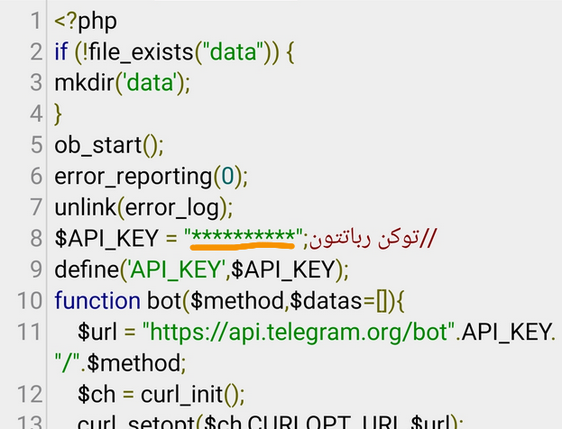

# ddos botnet in the Telegram

<h2>
آموزش حمله ddos در ترموکس و کنترل در ربات تلگرام
</h2>
<h5> 
با این اسکریپت میتونید از طریق حملات دیداس سایت ها رو از کار بندازید! 
 
با قابلیت کنترل از طریق ربات تلگرام و آپلود روی هاست
</h5>
 
<h5>
ابتدا اسکریپت را از لینک زیر دانلود کنید:
 
<a href="https://github.com/HACKGM/ddos/archive/refs/heads/main.zip">https://github.com/HACKGM/ddos/archive/refs/heads/main.zip</a>
 
سپس کد ddos.php رو در هاست آپلود کنید و توکن خودتون رو جایگزین ***** کنید مثل تصویر زیر:

 
سپس ربات رو ست وبهوک کنید، 
واسه ست وبهوک کافیه در کد زیر جلوی کلمه bot توکن رباتتون رو بنویسید  و جلوی = هم لینک فایل ddos.php که توی هاست اپلود کردید بنویسید ، سپس لینک رو در مرورگر وارد کنید تا ربات روی سورس ست وبهوک بشه 
 
<pre>http://api.telegram.org/bot1144899154:AAG3a7sUpVZWiPLj9KOCnOf_oDS-JlVpE/setwebhook?url=https://000webhostapp.com/ddos.php
</pre>
 
کافیه تعدادی از این سورس رو روی هاست اپلود کنید و همشونو استارت کنید و به ربات ها دستور حمله رو ارسال کنید،
 

اخر لینک با یه فاصله باید تعداد حمله رو بزارید و اولش هم a/ بزارید،
هرچی تعداد ربات هایی که میسازید بیشتر باشه قدرت حمله شما هم بیشتره.

________________________
